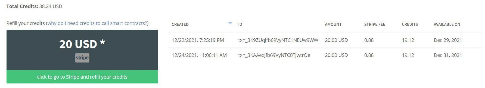

# Introduction

Welcome to [Blockchain Web Services](https://bweb.services) documentation!

# How To Start

To start using [Blockchain Web Services](https://bweb.services) go to [bweb.services](https://bweb.services) and sign-up. It's free.

## How It Works

[Blockchain Web Services](https://bweb.services) is a set of services made to **simplify the use of Smart Contracts** without the need to get blockchain accounts (e.g. Ethereum or Cardano) or having to go through heavy learning curves.

<aside class="notice">
You don't need to create any Blockchain account to use Blockchain Web Services.
</aside>

"*A smart contract is a computer program or a transaction protocol which is intended to automatically execute, control or document legally relevant events and actions according to the terms of a contract or an agreement.*" The [Wikipedia](https://en.wikipedia.org/wiki/Smart_contract).

## Required Funds

[Blockchain Web Services](https://bweb.services) is free, but calling Smart Contracts requires funds: "It is the fuel that allows it to operate" (you can check how Gas and Fuel works for Ethereum [here](https://ethereum.org/en/developers/docs/gas/)).

<aside class="notice">
We use Stripe as the Payment gateway for buying credits.
</aside>

To get your account funded go to `My Account > Credits` and complete your credits purchase.

<br/>


Remember **[Blockchain Web Services](https://bweb.services) is free** and funds are spent when calling smart contracts.

## API Endpoint

```javascript
$.ajax({
    method: 'POST',
    url: 'https://api.bweb.services/v1/call',
   ...
  });
```

Blockchain Web Services API baseline endpoint is **api.bweb.services** and current version is **v1**.

As an example, API operation **call** to execute a smart contract will use the following URL:

`https://api.bweb.services/v1/call`

## Authentication

```javascript
$.ajax({
   	...
    headers: {
      'Content-Type': 'application/json',
      'X-Api-Key': 'my-api-key'
    },
   	...
  });
```

Calling [Blockchain Web Services](https://bweb.services) smart contracts requires a personal **API Key** to authenticate. To get your key, sign in at [bweb.services](https://bweb.services) and go to `My Account > API Key`.

<br/>


You must include your Key in all of your API calls as a header attribute:

`'X-Api-Key': 'my-api-key'`

<aside class="notice">
You must replace <code>my-api-key</code> with your personal API key.
</aside>

## Passing parameters

Method call parameters must be passed in the Body part of the POST request message using [JSON](https://en.wikipedia.org/wiki/JSON) format and the `Content-Type` header attribute must be set to `application/json`.

> API call example.

```javascript
var parameters = {
  "contractId": "eth.rapten.database.immutable",
  "parameters": {
    ...
  }  
};

$.ajax({
  ...
  dataType: 'json',
  data: JSON.stringify(sellerJson),
  headers: {
    'Content-Type': 'application/json',
    'X-Api-Key': 'ExV0d92KzQ8QgsTVnevddpbB8cUaAfPs7ntVF8g0'
  }, 
  ...
  });

```

## API Calls Response

> API call response example


```
{
 "statusCode":200,
 "statusMessage":"",
 "info":  "{
    \"jobId\":\"543433243\"
  }"
}
```

> API call error response example


```
{
 "statusCode":404,
 "statusMessage":"incorrect parameters"
}
```

When calling the API, you can get an [HTTP](https://en.wikipedia.org/wiki/Hypertext_Transfer_Protocol) layer [transport error](https://en.wikipedia.org/wiki/List_of_HTTP_status_codes), that is, an error that has ocurried before the related API code is executed (e.g. 503, Service Unavailable), or a *controlled error*, meaning an error that is related to the parameters values you send (e.g. 404, not found - when no data is found for your query). By using this strategy, you will be able to catch and differentiate all kind of API call errors easily.

<br/>
When no transport layer error is detected, all the API calls will include the next message in the BODY part of the response:

Parameter | Type | Description
--------- | -------  | -----------
statusCode | number | The api call result code (e.g. 200 indicates no error).
statusMessage | string | The status code related message.
info | string | The requested information.

### Error Status Codes

The Blockchain Web Services API uses the following error Status Codes:

Status Code | Meaning
---------- | -------
400 | Bad Request -- Check your request parameters.
401 | Unauthorized -- Check your API key
403 | Forbidden / Too Many Requests -- Slow down!
404 | Not Found -- Your API key is valid but there is no related user on our servers.
405 | Method Not Allowed -- You tried to access with an invalid method
406 | Not Acceptable -- You requested a format that isn't json
410 | Gone -- The requested object has been removed
418 | I'm a teapot
429 | Too Many Requests -- Slow down!
500 | Internal Server Error -- We had a problem with our server. Try again later.
503 | Service Unavailable -- We're temporarially offline for maintanance. Please try again later.

# Smart Contracts

## Ethereum.Database.Immutable

This contract is used for database [immutable](https://en.wikipedia.org/wiki/Immutable_object) operations.

### Contract Address

Network | Address
--| --
ethereum |  
ropsten | 

### Operations

The following operations are used to save data into Ethereum [blockchain](https://en.wikipedia.org/wiki/Blockchain) [distributed ledger](https://en.wikipedia.org/wiki/Distributed_ledger) database.

> Call a Smart Contract.

```javascript
var parameters = {
    "...": "..."
}

$.ajax({
    method: 'POST',
    url: 'https://api.bweb.services/call',
    data: JSON.stringify(sellerJson),
    headers: {
      'Content-Type': 'application/json',
      'X-Api-Key': 'ExV0d92KzQ8QgsTVnevddpbB8cUaAfPs7ntVF8g0'
    },
    dataType: 'json',
    success: function (response) {
      console.log(response); 
    },
    error: function (xhr, textStatus, errorThrown) {
      console.log(xhr);
    }
  });
```

> If successfull, the call will return the related Job Id to fetch for results.

Use this method to call a Smart Contract.

<aside class="notice">
...
</aside>

### HTTP Request

`POST https://api.bweb.services/call`

### Request Parameters

Parameter | Type | Description | Notes
--------- | -------  | ----------- | -------
networkId | string | The Blockchain network you want to use | check the list of available networks.